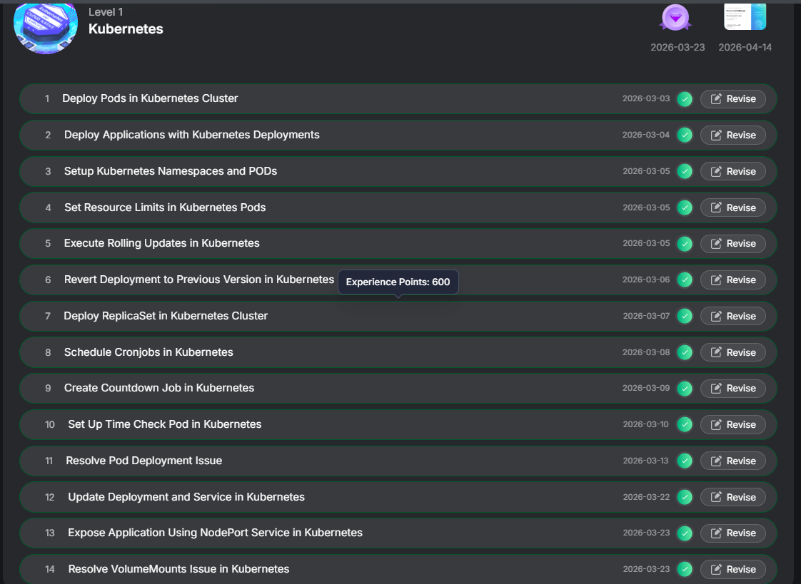

# Kubernetes - Hands-on Tasks

This section covers container orchestration tasks using Kubernetes.

##  Tasks Completed

- Deploy Pods in Kubernetes Cluster  
- Deploy Applications using Deployments  
- Setup Namespaces and Pods  
- Set Resource Limits in Pods  
- Execute Rolling Updates  
- Revert Deployment to Previous Version  
- Deploy ReplicaSet  
- Schedule CronJobs  
- Create Countdown Job  
- Setup Time Check Pod  
- Resolve Pod Deployment Issues  
- Update Deployment and Service  
- Expose Application using NodePort Service  
- Resolve Volume Mount Issues  

##  Skills Gained

- Pod and deployment management  
- Scaling and updates (rolling updates & rollback)  
- Working with services and networking  
- Scheduling jobs using CronJobs  
- Troubleshooting cluster issues  

##  Proof

